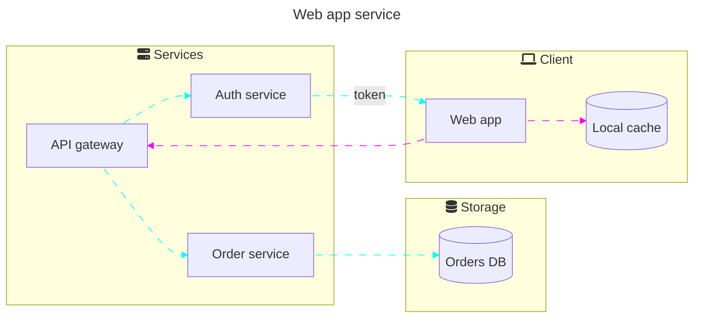

# Mermaid Diagrams

## Flowchart

### Syntax

- To define a node, use `<variableName>@{shape: <shape>, label: "<label>"}`.
- `<shape>`: One of the following name:
  - `bang`: Bang
  - `browser`: Browser window
  - `bucket`: Object storage bucket
  - `notch-rect`: Represents a card
  - `cloud`: cloud
  - `hourglass`: Represents a collate operaton
  - `bolt`: Communiation link
  - `brace`: Adds a comment
  - `brace-r`: Adds a comment
  - `braces`: Adds a comment
  - `console`: Terminal or console window
  - `lean-r`: Represents input or output
  - `lean-l`: Represents input or output
  - `datastore`: Data flow diagram data store
  - `cyl`: Database storage
  - `diam`: Decision-making step
  - `delay`: Represents a delay
  - `h-cyl`: Direct access storage
  - `lin-cyl`: Disk storage
  - `curv-trap`: Represents a display
  - `div-rect`: Divided process shape
  - `doc`: Represents a document
  - `rounded`: Represents an event
  - `tri`: Extraction process
  - `folder`: Folder or directory
  - `fork`: Fork or join in process flow
  - `win-pane`: Internal storage
  - `f-circ`: Junction point
  - `lin-doc`: Lined document
  - `lin-rect`: Lined process shape
  - `notch-pent`: Loop limit step
  - `flip-tri`: Manual file operation
  - `sl-rect`: Manual input step
  - `trap-t`: Represents a manual task
  - `docs`: Multiple documents
  - `st-rect`: Multiple processes
  - `odd`: Odd shape
  - `flag`: Paper tape
  - `person`: Person (circular head above a rouded body)
  - `hex`: Preparation or condition step
  - `trap-b`: Priority action
  - `rect`: Standard process shape
  - `circle`: Starting point
  - `sm-circ`: Small starting point
  - `dbl-circ`: Represents a stop point
  - `fr-circ`: Stop point
  - `bow-rect`: Stored data
  - `fr-rect`: Subprocess
  - `cross-circ`: Summary
  - `tag-doc`: Tagged document
  - `tag-rect`: Tagged process
  - `stadium`: Terminal point
  - `text`: Text block
- To define a node that is a specific service, program or file type,
  use `<variableName>@{ icon: "<icon-set>:<icon-name>", form: "square", label: "<label>", pos: "t", h: 48}`.
- `<icon-set>`: One of the following names:
  - `logos`: https://github.com/gilbarbara/logos
  - `devicon`: https://github.com/devicons/devicon
  - `thesvg`: https://github.com/glincker/thesvg
  - `thesvg-color`: https://github.com/glincker/thesvg
- Code blocks are defined with the following procedures:
  1. Subgraphs and Nodes
  2. Links
  3. Styling and classes

### Example

### Reference

https://mermaid.js.org/syntax/flowchart.html
